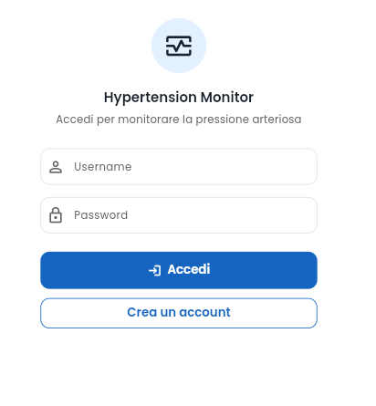
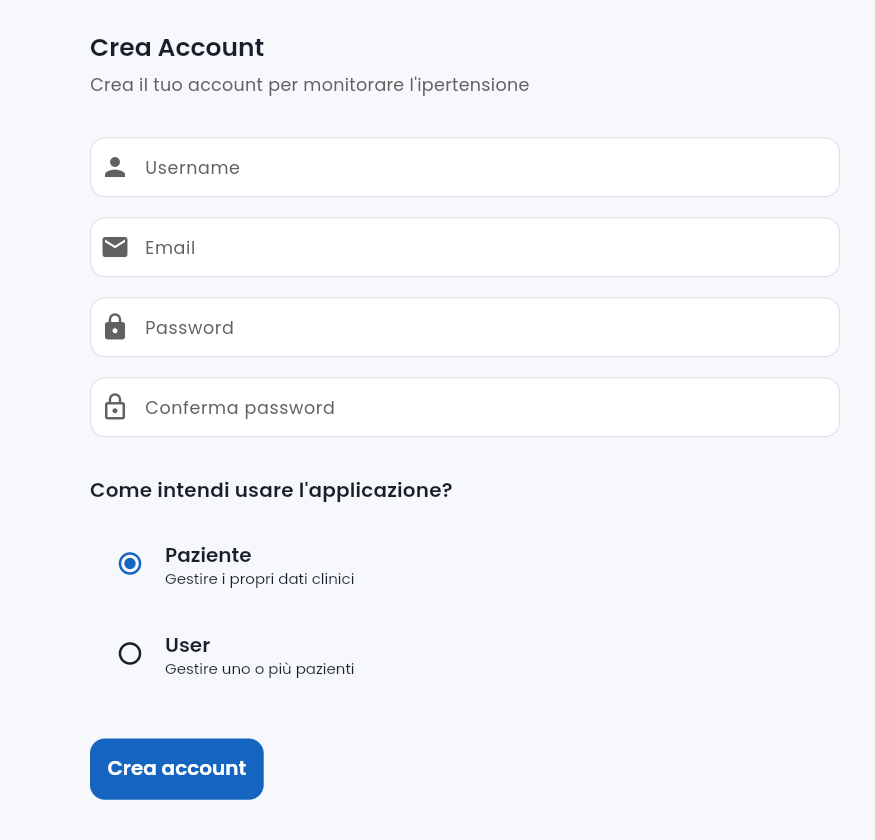
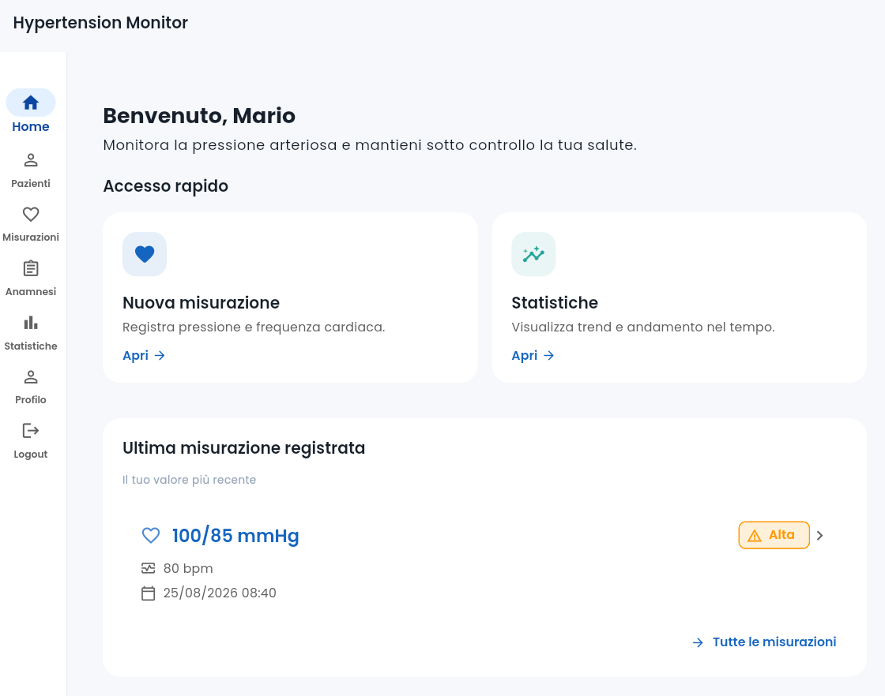
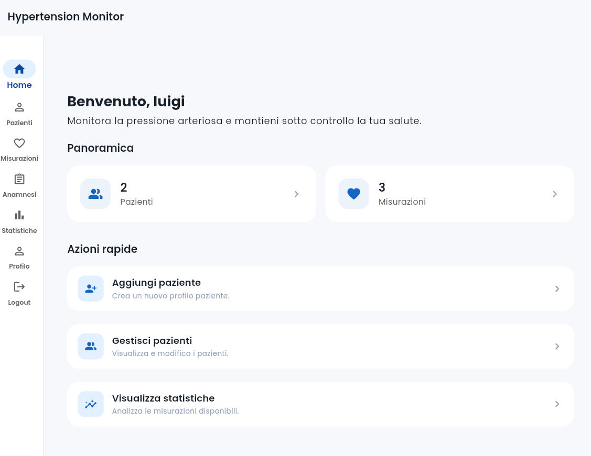
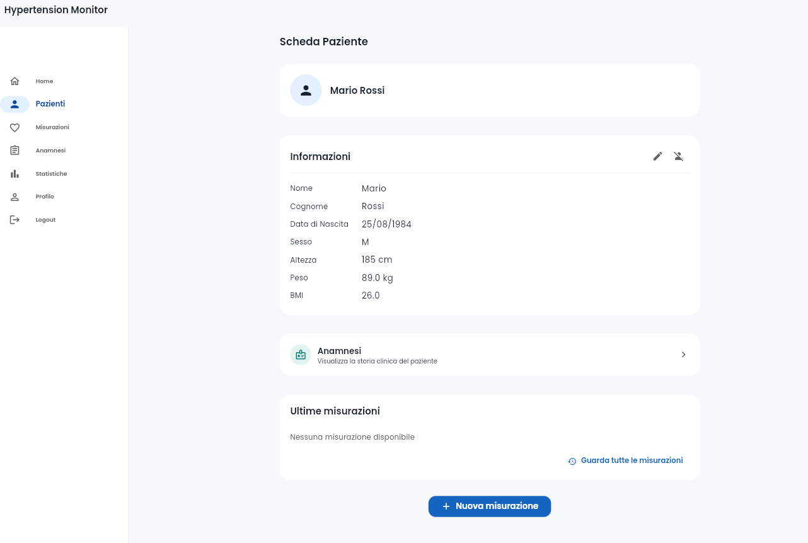
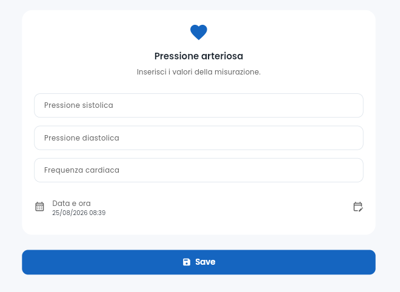
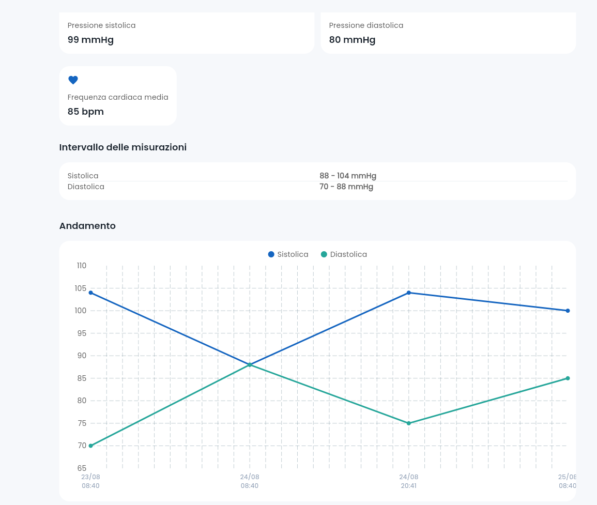

# Giada Pierucci - 331320

# Hypertension Monitor 

## Descrizione del Progetto 

**Hypertension Monitor** è un'applicazione mobile e web sviluppata tramite **Flutter** ed il linguaggio di programmazione **Dart** per la gestione ed il monitoraggio della pressione arteriosa di particolare interesse soprattutto per soggetti a rischio di ipertensione. 

L'applicazione permette di 

* gestire gli account degli utenti e i relativi profili paziente, 
* registrare le misurazioni della pressione arteriosa e della frequenza cardiaca, 
* consultare lo storico delle misurazioni, 
* gestire l'anamnesi clinica, 
* visualizzare statistiche sull'andamento della pressione. 

--- 

## Casi d'uso e Interfaccia Utente

Una caratteristica fondamentale dell'applicazione è data dalla possibilità di poter scegliere la tipologia di Account che si vuole creare ed utilizzare: 

* **Account Paziente**: il soggetto che crea l'account agisce come unico paziente (*Utente = Paziente*);
* **Account Utente**: il soggetto che crea l'account non intende usarla per scopi personali ed individuali, bensì per usarla al fine di monitorare e gestire altri soggetti/pazienti  (*Utente ≠ Paziente*). 

La diversa tipologia di account supportati comporta un'interazione differente con l'applicazione. 

Le principali funzionalità dell'applicazione sono: 

### Login e Registrazione 

All'avvio l'utente può effettuare l'accesso inserendo username e password. Qualora non possieda ancora un account, può accedere alla schermata di registrazione e crerne uno con la tipologia che preferisce. 

  

  

### Home 
Dopo aver eseguito il login, l'utente viene indirizzato alla schermata principale (**Home**). 
Quest'ultima, in seguito aver creato il o un paziente ed in base alla tipologia di account, permette di consultare informazioni e di accedere alle varie sezioni senza ricorrere ai menu. 

  

  

### Gestione dei Pazienti 

Gli utenti che possono gestire più pazienti (**Account Utente**) possono visualizzare l'elenco dei profili disponibili e selezionare il paziente da gestire. 

Per entrambe le tipologie di account, per ogni paziente è disponibile una scheda dedicata contenente le principali informazioni personali tra cui: 

- nome e cognome;
- data di nascita;
- sesso;
- altezza;
- peso;
- BMI.

Dalla scheda paziente è possibile modificare le informazioni del profilo oppure eliminarlo.

La creazione e la modifica del profilo utilizzano un form comune, che permette di inserire i dati che vengono richiesti. 

  

### Gestione dell'Anamnesi 

Sia dalla scheda paziente (tramite la pagina **Pazienti**) che dalla pagina **Anamnesi**, è possibile accedere, modificare ed eliminare le informazioni relative alla storia medica del paziente. 
Inoltre, in base alla patologie o malattie selezionate, è possibile ottenere informazioni su queste. Nel dettaglio, viene effettuata una richiesta http a **MedlinePlus Connect**, un servizio gratuito della *National Library of Medicine* degli Stati Uniti dalla quale possono essere estrapolate delle informazioni sanitarie. 
Tuttavia, il servizio restituisce le informazioni in lingua inglese. 

### Inserimento delle Misurazioni 

Le misurazioni della pressione possono essere registrate direttamente dalla scheda del paziente oppure, nel caso dell' Account Paziente, anche dalla pagina **Misurazioni**.

L'utente può inserire i valori relativi alla pressione sistolica, alla pressione diastolica e alla frequenza cardiaca, insieme alla data ed all'ora della misurazione tramite l'interfaccia dedicata. 

  

Le misurazioni vengono visualizzate nello storico del paziente o nella pagina delle Misurazioni, ordinate dalla più recente alla più datata. 

Dalla lista si può selezionare una singola misurazione ed eventualmente eliminarla. 

### Visualizzazione delle statistiche 

La sezione **Statistiche** permette di osservare la media e l'andamento nel tempo della pressione arteriosa per un paziente. 

Per gli utenti che gestiscono più pazienti si deve selezionare il paziente tramite il menu a tendina. Nel dettaglio si mostrano: 

- numero totale delle misurazioni;
- pressione sistolica media;
- pressione diastolica media;
- frequenza cardiaca media;
- valori minimo e massimo della pressione sistolica;
- valori minimo e massimo della pressione diastolica;
- andamento della pressione nel tempo.

Il grafico mostra separatamente la pressione sistolica e diastolica distinguendole con due colori ed una leggenda. Le misurazioni sono ordinate cronologicamente per rappresentare l'evoluzione nel tempo a differenza della visualizzazione nello storico delle misurazioni.

  

--- 

## Tecnologia 

### Dependencies 

Per questo progetto sono stati utilizzati i seguenti pacchetti aggiuntivi:

* [flutter_riverpod](https://pub.dev/packages/flutter_riverpod) per la gestione dello stato dell'applicazione. 
* [uuid](https://pub.dev/packages/uuid) per la gestione degli identificativi.
* [intl](https://pub.dev/packages/intl) utilizzato per la formattazione delle date.
* [fl_chart](https://pub.dev/packages/fl_chart) per la realizzazione del grafico dell'andamento della pressione arteriosa. 
* [hive_ce](https://pub.dev/packages/hive_ce), [hive_ce_flutter](https://pub.dev/packages/hive_ce_flutter) e [hive_ce_generator](https://pub.dev/packages/hive_ce_generator) (Community Edition) per realizzare la persistenza locale dei dati. 
* [http](https://pub.dev/packages/http) per le richieste al servizio gratuito MedlinePlus Connect. 
* [google_fonts](https://pub.dev/packages/google_fonts) per lo stile. 

## Scelte implementative 

* L'applicazione è stata sviluppata per essere responsive, sia per dispositivi mobili (con viusualizzazione orizzontale e verticale), sia per versione web. In base alla dimensionalità della finestra o dello schermo vengono utilizzati Drawer, Navigation Rail e Bottom Navigation Bar. 
* Viene richiesta una registrazione iniziale e successivi login ogni qualvolta l'utente esce ed intende poi accedere all'applicazione.
* Inizialmente si è pensato di definire solamente un'unica tipologia di account, ossia quella del singolo paziente. Successivamente però si è pensato di implementare anche al tipologia Utente per supportare al multi-gestione indiretta del monitoraggio dell'ipertensione. Durante l'utilizzo, si è a conoscenza di quale Account si sta utilizzando, in quanto si mantiene l'utente autenticato e la sessione tramite un provider dedicato. Questo permette di adattare la visualizzazione e le funzionalità disponibili al ruolo dell'account. 
* Si è inoltre deciso di eseguire richieste http ad un servizio sanitario gratuito in maniera opzionale ed in base alla condizione clinica registrata nell'anamnesi del paziente.